# Hi, I'm Lim Jia Yong 👋

**Builder. Founder. Software Engineer.**

I build AI-powered products and web applications — from zero to production. Currently running two startups, client work, and a product in stealth, all at once.

---

## 🚀 What I'm Building

| Project | What it is |
| :--- | :--- |
| [**TalentScreen AI**](https://talentscreen-ai.com/) | AI-powered virtual interviewer platform — co-founded, handles end-to-end screening |
| [**Soft Lead Solutions**](https://softlead.net/) | My software agency — web builds, SEO, and AI integrations for SMEs |
| **EduKids Web** | Multi-app educational & management platform |
| **Ask Lah** | Hackathon project |

---

## 🛠 Tech Stack

**Languages & Frameworks**

**AI & Integrations**

**CMS & Tools**

---

## 📊 GitHub & Coding Stats

  
  

  

**Coding stats (all-time)**

<!--WAKATIME_ALLTIME:START-->
| Metric | Value |
| :--- | :--- |
| Total time coded | 127 hrs 23 mins |
| Current streak | 0 days |
| Best day | 6 hrs 5 mins (2026-07-17) |

<!--WAKATIME_ALLTIME:END-->

**Currently building (last 30 days)**

<!--WAKATIME:START-->
| Project | Time |
| :--- | :--- |
| zeroticket | 8 hrs 33 mins |
| dispute-filter-report | 6 hrs 13 mins |
| edukids-web | 5 hrs 51 mins |
| Jy Vault | 5 hrs 49 mins |
| jy-vault-interactive | 4 hrs 30 mins |
| ekids-auth | 2 hrs 55 mins |
<!--WAKATIME:END-->

Source: WakaTime API · auto-updated daily via GitHub Action

---

## 🎓 Education

**Bachelor of Science (Hons) in Information Technology** — First Class Honours, CGPA 3.87
Asia Pacific University (APU), Malaysia

---

## 📫 Let's Connect

